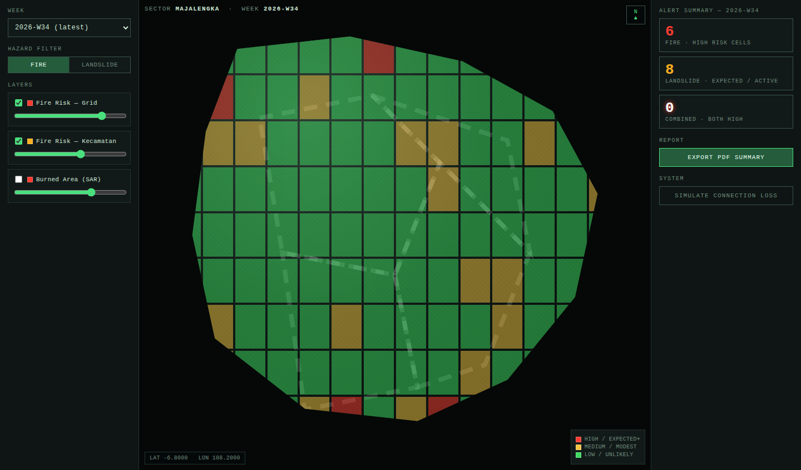
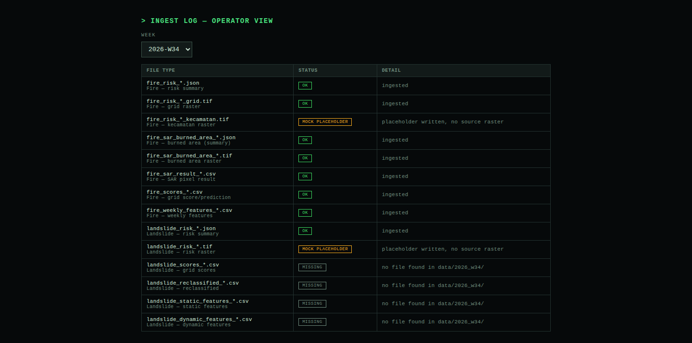
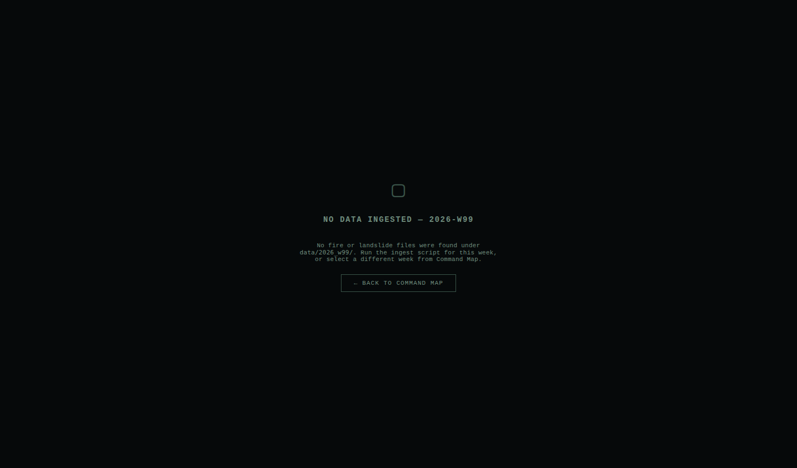
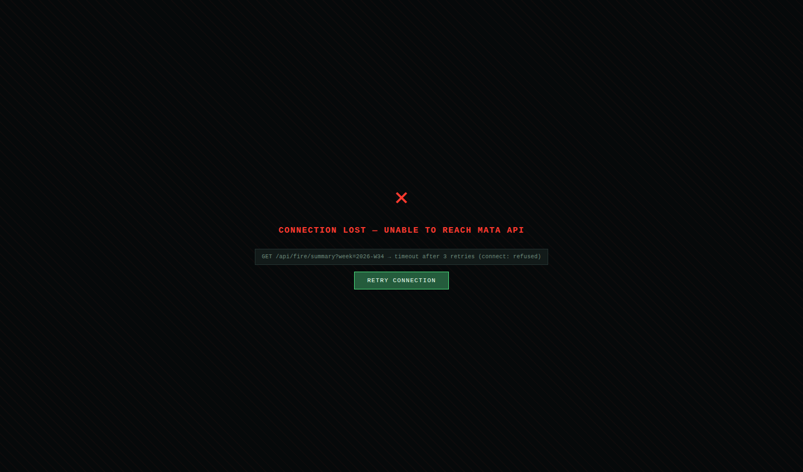

# Storyboard — MATA Hazard Command

> Live reference: open ./mockup.html in a browser.
> Screenshots of each screen live in ./images/.

## Screen 1 — Command Map (Dashboard)

- **Purpose:** the primary/default screen — spatial view of fire or landslide risk across Majalengka for a selected week, with an at-a-glance alert count and PDF export.
- **Key elements:**
  - Left sidebar: week selector, Fire/Landslide hazard toggle, per-layer checkboxes + opacity sliders (Fire Risk – Grid, Fire Risk – Kecamatan, Burned Area under Fire; Landslide Risk under Landslide).
  - Center: satellite-style map, kecamatan boundary lines, colored grid cells (red=high, yellow=medium, green=low), coordinate readout (bottom-left), color legend (bottom-right), compass (top-right), sector/week title (top-left).
  - Right sidebar: three alert cards (Fire High, Landslide Expected/Active, Combined — both high), Export PDF button, "Simulate Connection Loss" (system/demo control).
- **User actions:**
  - Change week dropdown → reloads cell data for that week; if the week has no ingested data, navigates to Screen 3 (Empty Week).
  - Click Fire / Landslide toggle → swaps which hazard's tiers color the grid and which layer rows show in the sidebar; re-renders map and alert counts.
  - Toggle a layer checkbox / drag its opacity slider → shows/hides or dims that layer's contribution to the map (a layer with `status: missing` is disabled with a "no raster ingested" note instead of a slider).
  - Click a grid cell → opens a floating popup at the click point with that cell's score/tier and supporting metrics for the currently active hazard.
  - Click an alert card (Fire / Landslide / Combined) → flashes the matching cells on the map and shows a toast ("Zoomed to N … alert area(s)").
  - Click "Export PDF Summary" → opens the export modal (in-page, not a separate screen — see Journey Summary step 6).
  - Click "Simulate Connection Loss" or the header link-status pill → navigates to Screen 4 (Error State).
  - Click "Ingest Log" in the header nav → navigates to Screen 2.
- **Transitions:** → Screen 2 (header nav), → Screen 3 (week dropdown, no-data week), → Screen 4 (link pill / simulate button).
- **States:** default (populated week, e.g. 2026-W34 with the Fire Risk – Kecamatan layer showing its disabled/no-raster state since that layer is mock-only for W34); a layer-missing state per layer (sidebar row disabled, map simply omits that layer's contribution); popup-open state (transient, dismissed by ✕ or a new cell click).

## Screen 2 — Ingest Log

- **Purpose:** operator-facing view (Budi persona) of per-file ingest status for a week, so it's clear which layers are live vs. placeholder vs. absent before trusting the map.
- **Key elements:** week selector, table of the 14 expected file types (fire + landslide) with a status chip (OK / MOCK PLACEHOLDER / MISSING) and a one-line detail per row.
- **User actions:** change week dropdown → reloads the table for that week (mirrors the real gaps in `data/`: W34 has kecamatan-tif + landslide-risk-tif as MOCK and all landslide CSVs MISSING; W31 is fully OK; W30 is missing the fire grid tif and two fire CSVs; W99 is entirely MISSING).
- **Transitions:** → Screen 1 via the "Command Map" header tab.
- **States:** only a populated table state — status per row is data-driven (OK/MOCK/MISSING), so there's no separate empty state for this screen itself (an all-MISSING week, e.g. W99, is still a fully rendered table, just all-MISSING rows).

## Screen 3 — Empty Week

- **Purpose:** explicit empty state when the selected week has no ingested data at all, so the operator isn't shown a blank/broken map.
- **Key elements:** centered glyph, "NO DATA INGESTED — 2026-W99" heading, one-line explanation naming the expected `data/` folder, a "Back to Command Map" button.
- **User actions:** click "Back to Command Map" → returns to Screen 1 (map re-renders with the previously selected populated week's dropdown value still showing the empty week — real app should reset the selector to a valid week on return).
- **Transitions:** → Screen 1.
- **States:** single state — this screen only ever shows the no-data message.

## Screen 4 — Connection Error

- **Purpose:** explicit error state for API/DB unreachability, so a failed request reads as a clear system fault rather than a silent blank dashboard.
- **Key elements:** red glyph, "CONNECTION LOST — UNABLE TO REACH MATA API" heading, a one-line technical trace (mock: a timed-out `GET /api/fire/summary` call), "Retry Connection" button. Header's link-status pill also flips to an "offline" (red) indicator in this state.
- **User actions:** click "Retry Connection" → shows a "Connection restored" toast and returns to Screen 1.
- **Transitions:** → Screen 1 (retry).
- **States:** single state in the mockup; the real app additionally needs a *partial*-failure variant (e.g. `/weeks` succeeds but `/fire/summary` fails) — out of scope for this storyboard, flag for implementation.

## Journey Summary

1. Operator opens the dashboard → Screen 1 loads with the latest ingested week (2026-W34), Fire hazard active by default, map colored by fire tier.
2. Operator reviews the Alert Summary cards (Fire High / Landslide Expected+ / Combined) to judge whether anything needs attention this week.
3. Operator clicks "Landslide" in the hazard toggle → map recolors by landslide category, sidebar swaps to the Landslide Risk layer control.
4. Operator adjusts the Landslide Risk layer's opacity slider to see the satellite basemap underneath more clearly.
5. Operator clicks a red (high-risk) grid cell → popup shows grid id, category, score, slope, and rainfall for that cell.
6. Operator clicks "Export PDF Summary" → export modal opens in-place on Screen 1, shows week + current hazard filter, operator clicks "Generate Report" → spinner ("COMPILING REPORT...") → success state with the generated filename → toast confirms → modal auto-closes.
7. Operator (as Budi) switches to Screen 2 via the header "Ingest Log" tab to confirm which files were live vs. placeholder for the week just reported on, then returns to Screen 1.
8. If the operator instead picks an uningested week (2026-W99) from the dropdown on Screen 1 → Screen 3 (Empty Week) explains why and offers a way back.
9. If the API becomes unreachable at any point → Screen 4 (Connection Error) replaces the current view; "Retry Connection" returns to Screen 1 once the link is back.
